# **Traffic Sign Recognition**

## Writeup
---

**Build a Traffic Sign Recognition Project**

The goals / steps of this project are the following:
* Load the data set (see below for links to the project data set)
* Explore, summarize and visualize the data set
* Design, train and test a model architecture
* Use the model to make predictions on new images
* Analyze the softmax probabilities of the new images
* Summarize the results with a written report


[//]: # (Image References)

## Rubric Points
### Here I will consider the [rubric points](https://review.udacity.com/#!/rubrics/481/view) individually and describe how I addressed each point in my implementation.  

---
### Writeup / README

#### 1. Provide a Writeup / README that includes all the rubric points and how you addressed each one. You can submit your writeup as markdown or pdf. You can use this template as a guide for writing the report. The submission includes the project code.

Here is a link to the [project code](https://github.com/udacity/CarND-Traffic-Sign-Classifier-Project/blob/master/Traffic_Sign_Classifier.ipynb)

### Data Set Summary & Exploration

#### 1. Provide a basic summary of the data set. In the code, the analysis should be done using python, numpy and/or pandas methods rather than hardcoding results manually.

Summary statistics of the traffic signs data set is provided below:
* The size of training set is : 34799
* The size of the validation set is : 4410
* The size of test set is :12630
* The shape of a traffic sign image is : (32, 32, 3)
* The number of unique classes/labels in the data set is : 43

#### 2. Include an exploratory visualization of the dataset.

Here is an exploratory visualization of the data set. It is a bar chart showing
the number of training samples for each of the 43 classes.

<p align="center">

</p>
<p align="center">
<em> Histogram showing distribution of samples across different classes in the training dataset</em>
</p>

<p align="center">
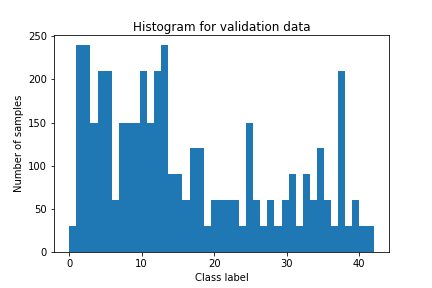
</p>
<p align="center">
<em> Histogram showing distribution of samples across different classes in the validation dataset</em>
</p>

<p align="center">
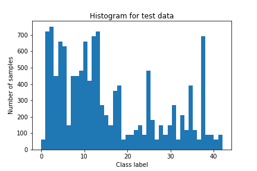
</p>
<p align="center">
<em> Histogram showing distribution of samples across different classes in the test dataset</em>
</p>

It is observed that the distribution of samples is similar for the train, validation and test datasets.

### Design and Test a Model Architecture

#### 1. Describe how you preprocessed the image data. What techniques were chosen and why did you choose these techniques? Consider including images showing the output of each preprocessing technique. Pre-processing refers to techniques such as converting to grayscale, normalization, etc. (OPTIONAL: As described in the "Stand Out Suggestions" part of the rubric, if you generated additional data for training, describe why you decided to generate additional data, how you generated the data, and provide example images of the additional data. Then describe the characteristics of the augmented training set like number of images in the set, number of images for each class, etc.)

As a first step, the images were converted to grayscale because the traffic signs can be
distinguished by the shape without the need for color distinction. Processing the image without conversion would make the inputs three times larger. Here is an example of a traffic sign image before and after grayscaling.

<p align="center">
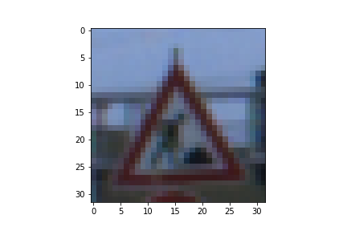
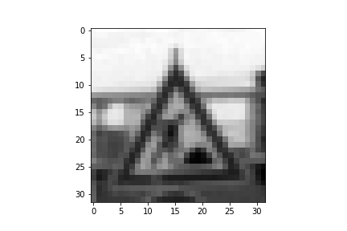
</p>
<p align="center">
<em> Sample image (left) and its grayscale version (right)
</p>

The grayscale input was then normalized by using the following code snippet:
```python
X_train_gray = (X_train_gray - 128) / 128.0
X_valid_gray = (X_valid_gray - 128) / 128.0
X_test_gray = (X_test_gray - 128) / 128.0
```

Since the values in a grayscale image ranges from 0 to 255, the above normalization
will ensure that the normalized result lies in the range -1 to +1.
When the model was trained on resulting training dataset, it was hard to
consistently get the target accuracy on the validation set. After some
[research](https://medium.com/@vivek.yadav/dealing-with-unbalanced-data-generating-additional-data-by-jittering-the-original-image-7497fe2119c3), I realized that the cause of the problem was that the skewed distribution
of samples across different classes in the training data set. Some
classes have a lot of samples while others have too few samples (in some cases
as few as two samples). A neural network model trained on such skewed data is
likely to be biased towards the classes that have many samples. One way to fix this deficiency in the training data is to
augment the training data with more samples in the classes that contain few
samples.

To add more data to the the data set, the following approach was used:

* Based on the histogram, an *augmentation factor* was computed for each class. The augmentation factor for a given class is defined as the ratio of
the number of samples in the class having the most samples to the number of samples in the given class minus one. The augmentation factor gives the number of additional versions to
be created for each training image of a particular class to make it comparable to the class having the most number of samples. The code snippet for computing the augmentation factor is
provided below:
```python
max_hist = max(hist)
augment_factor = [(max_hist // hist[i] - 1) for i in range(n_classes)]
```

* For each training image, extra versions of the image were generated (depending on the
  augmentation factor) by adding random noise based on a specified mean and variance.

The code snippet for adding noise is provided below:
```python
def add_noise(input_image, mean=0, var=10):
    sigma = var ** 0.5
    gaussian = np.random.normal(mean, sigma, input_image.shape)
    noisy_image = np.zeros(input_image.shape, np.float32)
    noisy_image[:, :, :] = input_image[:, :, :] + gaussian
    cv2.normalize(noisy_image, noisy_image, 0, 255, cv2.NORM_MINMAX, dtype=-1)
    noisy_image = noisy_image.astype(np.uint8)
````

Shown below is a sample image before and after adding noise:
<p align="center">

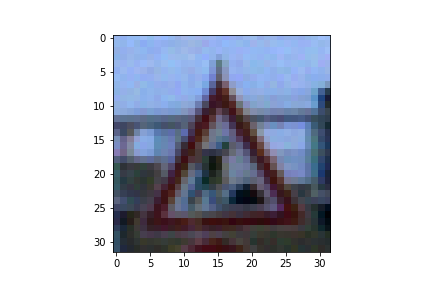
</p>
<p align="center">
<em> Sample image before (left) and after (right) adding noise
</p>

The histogram for the training data after augmentation is shown below:
<p align="center">
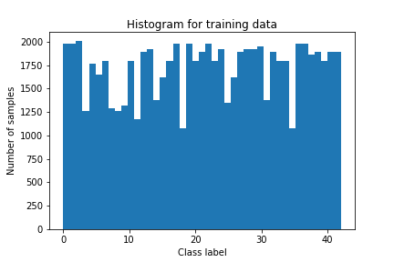
</p>
<p align="center">
<em> Sample image (left) and its grayscale version (right)
</p>

It is seen that after augmentation, the number of number of samples for research class is more
evenly distributed. No class has fewer than half the number of samples than the class
having the most number of classes.

#### 2. Describe what your final model architecture looks like including model type, layers, layer sizes, connectivity, etc.) Consider including a diagram and/or table describing the final model.

My final model consisted of the following layers:

| Layer         		|     Description	        					|
|-----------------------|-----------------------------------------------|
| Input         		| 32x32x1 grayscale image   							|
| Convolution 5x5     	| 1x1 stride, valid padding, outputs 28x28x10 	|
| RELU					|												|
| Max pooling	      	| 2x2 stride,  outputs 14x14x10				|
| Convolution 5x5	    |  1x1 stride, valid padding, outputs 10x10x25|
| Max pooling	      	| 2x2 stride,  outputs 5x5x25 				|
| RELU					|												|
| Flatten		| 5x5x25=625 nodes        									|
| Fully connected		| 120 nodes        									|
| RELU					|												|
| Dropout					| keep_prob=0.8												|
| Fully connected		| 84 nodes        									|
| RELU					|												|
| Output		| 43 nodes       									|


#### 3. Describe how you trained your model. The discussion can include the type of optimizer, the batch size, number of epochs and any hyperparameters such as learning rate.

The learning rate used for the simulation was 0.001. Other values were also experimented.
If the learning rate was too small, then the solution progress was too slow. If the
learning rate was too high then, after making rapid progress initially, the
solution abruptly collapsed (the accuracy dropped abruptly and drastically). A
learning rate of 0.005 showed good results too. However, the accuracies also showed oscillations of higher amplitude than with a learning rate of 0.001.

The number of epochs was chosen to be 15. With 15 epochs the results were more
consistently terminating with a validation accuracy greater than the target accuracy for
the last few epochs.

The batch size was kept at 128. Larger sizes were also considered but no meaningful
improvements were observed by increasing the batch size.

The Adam optimizer with the default settings was used as the optimizer.

#### 4. Describe the approach taken for finding a solution and getting the validation set accuracy to be at least 0.93. Include in the discussion the results on the training, validation and test sets and where in the code these were calculated. Your approach may have been an iterative process, in which case, outline the steps you took to get to the final solution and why you chose those steps. Perhaps your solution involved an already well known implementation or architecture. In this case, discuss why you think the architecture is suitable for the current problem.

My final model results were:
* training set accuracy of  0.995
* validation set accuracy of 0.941
* test set accuracy of 0.922

The solution process involved experimenting with different architectures. Initially
the LeNet architecture was chosen. The LeNet architecture was chosen because it is
a tried and tested architecture for image data. It uses convolutional layers which are
suited for image data. This architecture was also used
in the class lectures and was shown to be effective for a problem similar to the
one used in this project (i.e., 32x32 input image). However, using the baseline
LeNet architecture did not produce the desired validation accuracy. The performance
of the baseline LeNet architecture is shown below:

<p align="center">
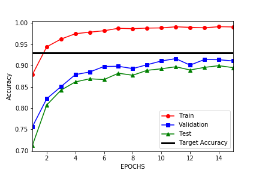
</p>
<p align="center">
<em> Performance on baseline LeNet architecture
</p>

As seen above, the performance of the baseline LeNet model on the validation dataset did
not meet target accuracy (0.93). Also, it can be seen that the model is
overfitting to the training data. In order to improve the accuracy of the
model, various parameters of the baseline LeNet model were adjusted. Some of these
experiments and their outcomes are discussed below:

* The number of nodes in the fully connected layers were increased. However, this did
not produce the desired outcome.

* Dropout was added for several layers to reduce overfitting on the training data. While this succeeded in reducing the models performance on the training data, it did not
succeed in improving the accuracy of validation and test datasets which also performed
worse with dropout.

In order to improve the performance on the validation and test data sets, number
of filters in the first convolutional layer was increased from 6 to 10 and the
number of filters in the second convolutional model was increased from 16 to 25.
This resulted in a good improvement for all datasets, as shown below:

<p align="center">
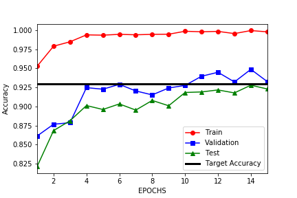
</p>
<p align="center">
<em> Performance on baseline LeNet architecture
</p>

The above configuration meets the target accuracy for the validation dataset. However,
the model is clearly overfitting, as seen by the nearly 6-7% difference between
the train and validation/test datasts. One way to reduce overfitting is to use
dropout. Since dropout had previously failed to produce the desired accuracy when
it was applied to several layers, this time, dropout (with keep_prob=0.8) was applied
only to the second fully connected layer. The performance on different datasets
is shown below:

<p align="center">
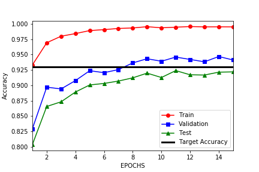
</p>
<p align="center">
<em> Performance on baseline LeNet architecture
</p>

It is observed that the addition of dropout improves performance modestly, with
accuracy increasing noticeably for both the validation and test datasets both in
the early and later epochs. The target accuracy on the validation data was achieved
as early as the 8th epoch, reaches a maximum of nearly 95% before finally settling
at 94.1% at the end of the 15th epoch. Adjusting the dropout further (increase/decrease)
did not however produce noticeably improvements in accuracy and therefore this
configuration was chosen as the final configuration.

### Test a Model on New Images

#### 1. Choose five German traffic signs found on the web and provide them in the report. For each image, discuss what quality or qualities might be difficult to classify.

The five German traffic signs obtained from the [web](https://en.wikipedia.org/wiki/Road_signs_in_Germany) are provided below:

<p align="center">
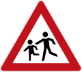


</p>
<p align="center">
<em> Five german traffic signs
</p>

For the first, second and fourth images, the picture is not simple and this may make it hard
to classify. The third image may get misclassified because there is a small gap between the
circles and it is not obvious whether the low image resolution (32x32) would consistently
allow the model to identify the shape. The final image (no entry) may be expected to be
relatively easy to classify. All images were pre-processed by converting to grayscale
and normalizing in the same manner as the training data (i.e., (image - 128)/128.0).

#### 2. Discuss the model's predictions on these new traffic signs and compare the results to predicting on the test set. At a minimum, discuss what the predictions were, the accuracy on these new predictions, and compare the accuracy to the accuracy on the test set (OPTIONAL: Discuss the results in more detail as described in the "Stand Out Suggestions" part of the rubric).

Here are the results of the prediction:

| Image			        |     Prediction	        					|
|:---------------------:|:---------------------------------------------:|
| Children crossing      		| Children crossing   									|
| Wild animals crossing      			| Wild animals crossing 										|
| Traffic signals					| Traffic signals											|
| Road work	      		| Road work					 				|
| No entry			| No entry      							|


The model was able to correctly guess all traffic signs. This compares favorably to the accuracy on the test set of which has an accuracy greater than 90%.

#### 3. Describe how certain the model is when predicting on each of the five new images by looking at the softmax probabilities for each prediction. Provide the top 5 softmax probabilities for each image along with the sign type of each probability. (OPTIONAL: as described in the "Stand Out Suggestions" part of the rubric, visualizations can also be provided such as bar charts)

For the first image, the model is moderately sure that this is a stop sign (probability of 0.576). The only other sign that has non-trivial probability (0.234) is "Right of way at the next intersection".

<p align="left">

</p>
<p align="left">
<em> "Children crossing" traffic sign
</p>
<p align="left">
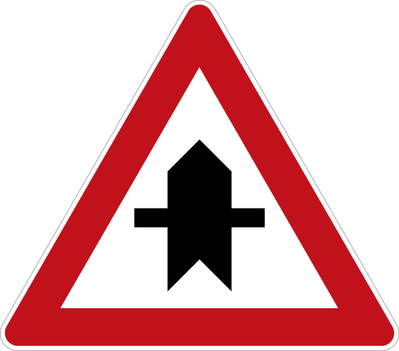
</p>
<p align="left">
<em> "Right of way at next intersection" traffic sign
</p>

| Probability         	|     Prediction	        					|
|:---------------------:|:---------------------------------------------:|
| .576         			    | Children crossing   									|
| .234     				      | Right of way at the next intersection	|
| .083					        | Pedestrians											      |
| .075	      			    | Beware of ice/snow					 				  |
| .032				          | Roundabout mandatory      						|


For the second image the model is fairly confident about its prediction (~75% probability)  
 and less than 8% for any other possibility.
<p align="left">

</p>
<p align="left">
<em> "Wild animals crossing" traffic sign
</p>

| Probability         	|     Prediction	        					|
|:---------------------:|:---------------------------------------------:|
| 0.7448       			    | Wild animals crossing  |
| 0.0793   		            | Road work              |
| 0.0659			    | Double curve           |
| 0.0604      			    | General caution        |
| 0.0497			    | Slippery road          |

For the third image the model is less than 50% sure that it corresponds to "Traffic signals", with "General caution" coming a close second. This is not surprising because both sign
have most of the pixels in a straight line at the center and both have at least one circle.

<p align="left">

</p>
<p align="left">
<em> Five "Traffic signals" traffic sign
</p>
<p align="left">
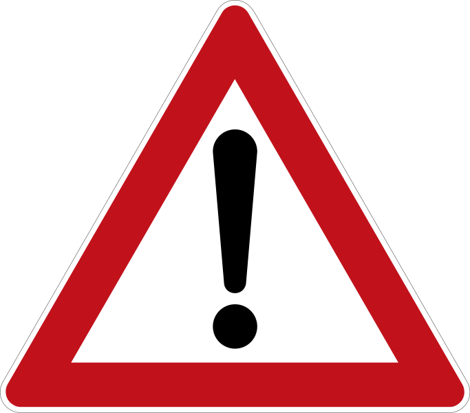
</p>
<p align="left">
<em> Five "General caution" traffic sign
</p>

| Probability         	|     Prediction	        					|
|:---------------------:|:---------------------------------------------:|
| 0.4547      			    | Traffic signals                  |
| 0.3803    		            | General caution                  |
| 0.0613 			    | Road narrows on the right        |
| 0.0574       			    | No vehicles                      |
| 0.0464 			    | Pedestrians                      |

For the fourth image, again the model is barely certain about its prediction (~43%) with "Dangerous curve to the right" coming a very close second (38.7%). Again there are some
similarities between the two images.
<p align="left">

</p>
<p align="left">
<em> "Road work" traffic sign
</p>
<p align="left">
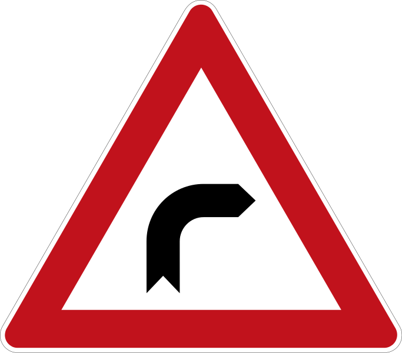
</p>
<p align="left">
<em> "Road work" traffic sign
</p>

| Probability         	|     Prediction	        					|
|:---------------------:|:---------------------------------------------:|
| 0.4357         		    | Road work                             |
| 0.3871     		            | Dangerous curve to the right          |
| 0.0853			    | General caution                       |
| 0.0487	      		    | Right-of-way at the next intersection |
| 0.0432			    | Pedestrians                           |


For the fifth image the model is fairly certain that it is a "No entry" sign, with
no other sign having more than 10% probability.
<p align="left">

</p>
<p align="left">
<em> "No entry" traffic sign
</p>

| Probability         	|     Prediction	        					|
|:---------------------:|:---------------------------------------------:|
| 0.7365         		    | No entry             |
| 0.0910     		            | Traffic signals      |
| 0.0694			    | Keep left            |
| 0.0521	      		    | Turn right ahead     |
| 0.0509			    | Roundabout mandatory |
