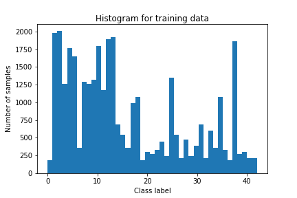

# **Traffic Sign Recognition**

## Writeup
---

**Build a Traffic Sign Recognition Project**

The goals / steps of this project are the following:
* Load the data set (see below for links to the project data set)
* Explore, summarize and visualize the data set
* Design, train and test a model architecture
* Use the model to make predictions on new images
* Analyze the softmax probabilities of the new images
* Summarize the results with a written report


[//]: # (Image References)

[image1]: ./examples/visualization.jpg "Visualization"
[image2]: ./examples/grayscale.jpg "Grayscaling"
[image3]: ./examples/random_noise.jpg "Random Noise"
[image4]: ./examples/placeholder.png "Traffic Sign 1"
[image5]: ./examples/placeholder.png "Traffic Sign 2"
[image6]: ./examples/placeholder.png "Traffic Sign 3"
[image7]: ./examples/placeholder.png "Traffic Sign 4"
[image8]: ./examples/placeholder.png "Traffic Sign 5"

## Rubric Points
### Here I will consider the [rubric points](https://review.udacity.com/#!/rubrics/481/view) individually and describe how I addressed each point in my implementation.  

---
### Writeup / README

#### 1. Provide a Writeup / README that includes all the rubric points and how you addressed each one. You can submit your writeup as markdown or pdf. You can use this template as a guide for writing the report. The submission includes the project code.

You're reading it! and here is a link to my [project code](https://github.com/udacity/CarND-Traffic-Sign-Classifier-Project/blob/master/Traffic_Sign_Classifier.ipynb)

### Data Set Summary & Exploration

#### 1. Provide a basic summary of the data set. In the code, the analysis should be done using python, numpy and/or pandas methods rather than hardcoding results manually.

I used the scikit-learn library to calculate summary statistics of the traffic
signs data set:
* The size of training set is : 34799
* The size of the validation set is : 4410
* The size of test set is :12630
* The shape of a traffic sign image is : (32, 32, 3)
* The number of unique classes/labels in the data set is : 43

#### 2. Include an exploratory visualization of the dataset.

Here is an exploratory visualization of the data set. It is a bar chart showing
the number of training samples for each of the 43 classes.

<p align="center">

</p>
<p align="center">
<em> Histogram showing distribution of samples across different classes in the training dataset</em>
</p>

<p align="center">

</p>
<p align="center">
<em> Histogram showing distribution of samples across different classes in the validation dataset</em>
</p>

<p align="center">

</p>
<p align="center">
<em> Histogram showing distribution of samples across different classes in the test dataset</em>
</p>

It is observed that the distribution of samples is similar for the train, validation and test datasets.


![alt text][image1]

### Design and Test a Model Architecture

#### 1. Describe how you preprocessed the image data. What techniques were chosen and why did you choose these techniques? Consider including images showing the output of each preprocessing technique. Pre-processing refers to techniques such as converting to grayscale, normalization, etc. (OPTIONAL: As described in the "Stand Out Suggestions" part of the rubric, if you generated additional data for training, describe why you decided to generate additional data, how you generated the data, and provide example images of the additional data. Then describe the characteristics of the augmented training set like number of images in the set, number of images for each class, etc.)

As a first step, I decided to convert the images to grayscale because the traffic signs can be
distinguished by the shape. Processing the image without conversion would make the first
convolutional layer three times larger.

Here is an example of a traffic sign image before and after grayscaling.
<p align="center">


</p>
<p align="center">
<em> Sample image (left) and its grayscale version (right)
</p>

The grayscale input was then normalized by using the following code snippet:
```python
X_train_gray = (X_train_gray - 128) / 128.0
X_valid_gray = (X_valid_gray - 128) / 128.0
X_test_gray = (X_test_gray - 128) / 128.0
```

Since the values in a grayscale image ranges from 0 to 255, the above normalization
will ensure that the normalized result lies in the range -1 to +1.

When the model was trained on resulting training dataset, it was hard to
consistently get the target accuracy on the validation set. After some
[research]() I realized that the cause of the problem was that the distribution
of samples across different classes in the training data set is too skewed. Some
classes have a lot of samples while others have too few samples (in some cases
as few as two samples). A neural network model trained on such skewed data is
likely to be biased towards the classes that have many samples over those that
have few samples. One way to fix this deficiency in the training data is to
augment the training data with more samples in the classes that contain few
samples.

To add more data to the the data set, the following approach was used:

* Based on the histogram, for each class an *augmentation factor* was computed as the ratio of
the number of samples in the class to the number of samples in the class having the most samples. The augmentation factor minus one gives the factor by which the number of samples
in a class need to be increased to make it comparable to the class having the most number
of samples
* For each training image, multiple versions of the image were generated (depending on the
  augmentation factor) by adding random noise based on a specified mean and variance.

The code snippet for adding noise is provided below:
```python
def add_noise(input_image, mean=0, var=10):
    sigma = var ** 0.5
    gaussian = np.random.normal(mean, sigma, input_image.shape)
    noisy_image = np.zeros(input_image.shape, np.float32)
    noisy_image[:, :, :] = input_image[:, :, :] + gaussian
    cv2.normalize(noisy_image, noisy_image, 0, 255, cv2.NORM_MINMAX, dtype=-1)
    noisy_image = noisy_image.astype(np.uint8)
````

Shown below is a sample image before and after adding noise:
<p align="center">


</p>
<p align="center">
<em> Sample image (left) and its grayscale version (right)
</p>

The histogram for the training data after augmentation is shown below:
<p align="center">

</p>
<p align="center">
<em> Sample image (left) and its grayscale version (right)
</p>

It is seen that after augmentation, the number of number of samples for research class is more
evenly distributed. This is because, the augmentation factor ensures that the ratio
of the max samples to the number of samples for any class is no greater than 1.5.

#### 2. Describe what your final model architecture looks like including model type, layers, layer sizes, connectivity, etc.) Consider including a diagram and/or table describing the final model.

My final model consisted of the following layers:

| Layer         		|     Description	        					|
|:---------------------:|:---------------------------------------------:|
| Input         		| 32x32x3 RGB image   							|
| Convolution 5x5     	| 1x1 stride, valid padding, outputs 28x28x10 	|
| RELU					|												|
| Max pooling	      	| 2x2 stride,  outputs 14x14x10				|
| Convolution 5x5	    |  1x1 stride, valid padding, outputs 10x10x25|
| Max pooling	      	| 2x2 stride,  outputs 5x5x25 				|
| RELU					|												|
| Flatten		| 5x5x25=625 nodes        									|
| Fully connected		| 120 nodes        									|
| RELU					|												|
| Fully connected		| 84 nodes        									|
| RELU					|												|
| Output		| 43 nodes       									|


#### 3. Describe how you trained your model. The discussion can include the type of optimizer, the batch size, number of epochs and any hyperparameters such as learning rate.

The learning rate used for the simulation was 0.001. Other values were also experimented.
If the learning rate was too small, then the solution process was too slow. If the
learning rate was too high then after making rapid initial progress initially, the
solution abruptly collapsed (the accuracy dropped abruptly and drastically). A
value of 0.005 showed good results too. Solution was consistently giving good
accuracies quickly. However, the accuracies also showed oscillations of higher
amplitude than with a leraning rate of 0.001.

The number of epochs was chosen to be 20. While target accuracy was often achieved
even for 10 epochs, it was less consistent. With 20 epochs the results were more
consistently terminating with a validation accuracy greater than the target accuracy.

The batch size was kept at 128. Larger sizes were also considered but no consistent
improvements were observed by increasing the batch size.

The optimization, the Adam optimizer was used with the default settings.

#### 4. Describe the approach taken for finding a solution and getting the validation set accuracy to be at least 0.93. Include in the discussion the results on the training, validation and test sets and where in the code these were calculated. Your approach may have been an iterative process, in which case, outline the steps you took to get to the final solution and why you chose those steps. Perhaps your solution involved an already well known implementation or architecture. In this case, discuss why you think the architecture is suitable for the current problem.

My final model results were:
* training set accuracy of  0.98
* validation set accuracy of 0.95
* test set accuracy of 0.92

If an iterative approach was chosen:
* What was the first architecture that was tried and why was it chosen?
* What were some problems with the initial architecture?
* How was the architecture adjusted and why was it adjusted? Typical adjustments could include choosing a different model architecture, adding or taking away layers (pooling, dropout, convolution, etc), using an activation function or changing the activation function. One common justification for adjusting an architecture would be due to overfitting or underfitting. A high accuracy on the training set but low accuracy on the validation set indicates over fitting; a low accuracy on both sets indicates under fitting.
* Which parameters were tuned? How were they adjusted and why?
* What are some of the important design choices and why were they chosen? For example, why might a convolution layer work well with this problem? How might a dropout layer help with creating a successful model?

If a well known architecture was chosen:
* What architecture was chosen?
* Why did you believe it would be relevant to the traffic sign application?
* How does the final model's accuracy on the training, validation and test set provide evidence that the model is working well?

The solution process involved experimenting with different architectures. Initially
the LeNet architecture was chosen. The LeNet architecture was chosen because it is
a tried and tested architecture for image data. This architecture was also used
in the class lectures and was shown to be effective for a problem similar to the
one used in this project (i.e., 32x32 input image). However, using the baseline
LeNet architecture did not produce the desired validation accuracy. The performance
of the baseline LeNet architecture is shown below:

As seen above, the performance of the LeNet model on the validation data set did
not produce the desired accuracy (0.93). Also it can be seen that the model is
overfitting to the training data. In order to improve the accuracy of the
model various parameters of the baseline LeNet model were adjusted. Some of these
experiments and their outcomes are discussed below:

* The number of nodes in the fully connected layers were increased. However, this did
not improve

* Dropout was added for several layers to reduce overfitting on the training data. However, while this succeeded in reducing the models performance on the training data, it did not
succeed in improving the accuracy of validation and test data sets which also performed
worse with dropout.

number of filters in the first convolutional layer was increased from
6 to 10 and the number of filters in the second convolutional model was increased
from

### Test a Model on New Images

#### 1. Choose five German traffic signs found on the web and provide them in the report. For each image, discuss what quality or qualities might be difficult to classify.

Here are five German traffic signs that I found on the [web](https://en.wikipedia.org/wiki/Road_signs_in_Germany):

<p align="center">


</p>
<p align="center">
<em> Five german traffic signs
</p>

For the first, second and fourth images, the picture is not simple and this may make it hard
to classify. The third image may get misclassified because there is a small gap between the
circles and it is not obvious whether the low image resolution (32x32) would consistently
allow the model to identify the shape. The final image (no entry) may be expected to be
relatively easy to correctly classify.

#### 2. Discuss the model's predictions on these new traffic signs and compare the results to predicting on the test set. At a minimum, discuss what the predictions were, the accuracy on these new predictions, and compare the accuracy to the accuracy on the test set (OPTIONAL: Discuss the results in more detail as described in the "Stand Out Suggestions" part of the rubric).

Here are the results of the prediction:

| Image			        |     Prediction	        					|
|:---------------------:|:---------------------------------------------:|
| Children crossing      		| Children crossing   									|
| Wild animals crossing      			| Wild animals crossing 										|
| Traffic signals					| Traffic signals											|
| Road work	      		| Road work					 				|
| No entry			| No entry      							|


The model was able to correctly guess all traffic signs. This compares favorably to the accuracy on the test set of which has an accuracy greater than 90%.

#### 3. Describe how certain the model is when predicting on each of the five new images by looking at the softmax probabilities for each prediction. Provide the top 5 softmax probabilities for each image along with the sign type of each probability. (OPTIONAL: as described in the "Stand Out Suggestions" part of the rubric, visualizations can also be provided such as bar charts)

The code for making predictions on my final model is located in the 11th cell of the Ipython notebook.

For the first image, the model is relatively sure that this is a stop sign (probability of 0.6), and the image does contain a stop sign. The top five soft max probabilities were

| Probability         	|     Prediction	        					|
|:---------------------:|:---------------------------------------------:|
| .576         			    | Children crossing   									|
| .234     				      | Right of way at the next intersection	|
| .083					        | Pedestrians											      |
| .075	      			    | Beware of ice/snow					 				  |
| .032				          | Roundabout mandatory      						|

| Probability         	|     Prediction	        					|
|:---------------------:|:---------------------------------------------:|
| .576         			    | Children crossing   									|
| .234     				      | Right of way at the next intersection	|
| .083					        | Pedestrians											      |
| .075	      			    | Beware of ice/snow					 				  |
| .032				          | Roundabout mandatory      						|


For the second image ...

Wild animals crossing 0.7448
Road work             0.0793
Double curve          0.0659
General caution       0.0604
Slippery road         0.0497

For the third image ...
1. Probability(Traffic signals) = 0.4547
2. Probability(General caution) = 0.3803
3. Probability(Road narrows on the right) = 0.0613
4. Probability(No vehicles) = 0.0574
5. Probability(Pedestrians) = 0.0464

For the fourth image ...
1. Probability(Road work) = 0.4357
2. Probability(Dangerous curve to the right) = 0.3871
3. Probability(General caution) = 0.0853
4. Probability(Right-of-way at the next intersection) = 0.0487
5. Probability(Pedestrians) = 0.0432

1. Probability(No entry) = 0.7365
2. Probability(Traffic signals) = 0.0910
3. Probability(Keep left) = 0.0694
4. Probability(Turn right ahead) = 0.0521
5. Probability(Roundabout mandatory) = 0.0509

### (Optional) Visualizing the Neural Network (See Step 4 of the Ipython notebook for more details)
#### 1. Discuss the visual output of your trained network's feature maps. What characteristics did the neural network use to make classifications?
